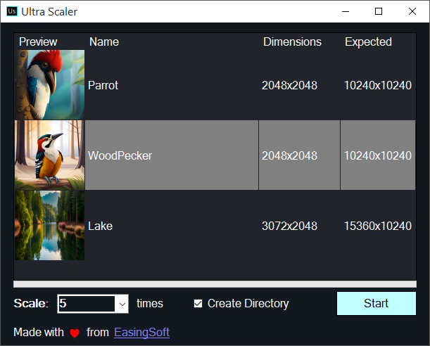

# UltraScaler
AI image upscaler software that can scale images up to 5x without losing quality. Due to vast trend for Generative AI content in market, I decided to make app that intelligently upscale my ai images in bulk, which can be sold on stock websites. Because they don't allow low res images.
Several ai image genertors like [Stable Diffusion](https://github.com/Stability-AI/stablediffusion), [Midjourney](https://www.midjourney.com), [BlueWillow](https://www.bluewillow.ai) allows upscaling, but are either slow or aren't automated.

# Difference
Before                     |  After
:-------------------------:|:-------------------------:
   |  

## How to get started ?
- Download and run [UltraScaler.exe](https://github.com/EasingSoft/UltraScaler/releases/tag/1)
- Drag and drop some images on it
- (OPTIONAL) Set scale from 2x to 5x (more big scale, more it takes time and more high resolution image be)
- (OPTIONAL) Check "Create Directory" checkbox, if want images output to a directory
- Click "Start" button and wait for operation to complete

## Features:
- Best compitable: Supports windows 7 and all later, both x86 and x64
- No GPU, driver etc need. Works well even on low end pc, on simple CPU. 
- Supports bulk operation
- Up to 5x upscaling

## Credits:
Thanks to xBRZ algorithum, which previously used for upscaling old game resources and still add huge contribution to our ai images.
- [xBRZ.NET](https://github.com/MiYanni/xBRZ.NET)
- [xBRZ in Java](https://intrepidis.blogspot.com/2014/02/xbrz-in-java.html)
- [xBRZ in C++ by Zenju](https://sourceforge.net/projects/xbrz)

## Contact for business queries:

